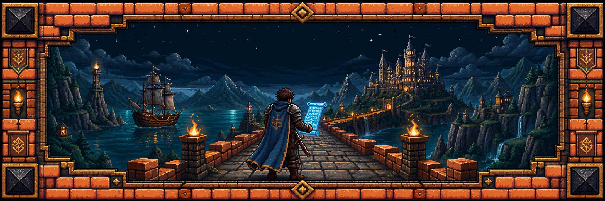
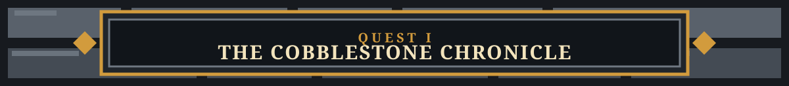
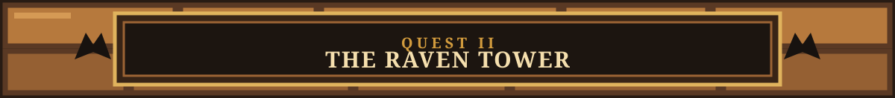
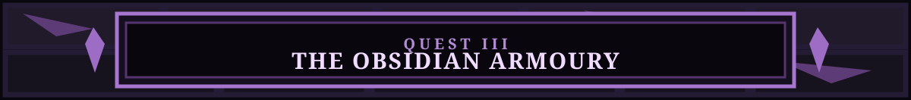
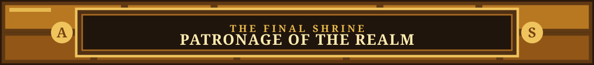

<h3>𓆩 ⚔ 𓆪</h3>

# 𝕿𝖍𝖊 𝕯𝖊𝖛𝖊𝖑𝖔𝖕𝖊𝖗'𝖘 𝕺𝖉𝖞𝖘𝖘𝖊𝖞

### *The Chronicle of Aliasgar Sogiawala*

### Knight of the Open Source Realm · Forger of Digital Kingdoms

  <em>“By quill, by code, and by an unreasonable number of commits.”</em>

 
 

`༺═──────────────═༻`

Hark! I am **Aliasgar Sogiawala**—a craftsman of the web, seeker of curious ideas, and builder of digital realms. Herein lies a record of the tools I wield, the quests I pursue, and the roads by which fellow travellers may find me.

- 📜 Studying the ancient and ever-growing lore of **Open Source**
- ⚒️ Forging worthy projects, one quest at a time
- 🏆 Crowned a **[Hackathon Victor](https://paradocc.vercel.app)**
- 🗣️ Ever willing to parley about technology, startups, and bold inventions

`༺═──────────────═༻`

  
  
  
  
  

| Order of the Realm | Arms, Artifacts & Enchantments |
|:--|:--|
| **🏹 The Guild of Frontend Artificers** |              |
| **🔨 The Brotherhood of Backend Smiths** |        |
| **🗝️ The Archive of Databases** |        |
| **☁️ The Sky Citadel** |  |
| **🛡️ The Keepers of the Gate** |    |
| **🔮 The Seers of Data** |       |
| **🎨 The Illuminators’ Atelier** |       |
| **🧰 The Tinkerers’ Workshop** |     |
| **🚢 The Harbours of Deployment** |   |

`༺═──────────────═༻`

Should my craft have served or delighted thee, thou mayest provision the workshop with a humble draught:

 

### ⚜️ *Thus endeth the scroll—for now.* ⚜️

Return anon; new quests are ever being forged.

